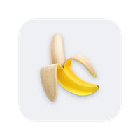

<h1 align="center">BananaTube</h1>

  

## About
BananaTube is an YouTube app but without any distractions.
 
No Shorts, no Recommendations.
 
Only you and your choice

## Dependencies
To set up dependencies, run `pod install`.

## Running
Open `BananaTube.xcworkspace`, change the bundle identifier to an identifier linked to your Apple developer account in order to run. Build using the `BananaTube` scheme.
